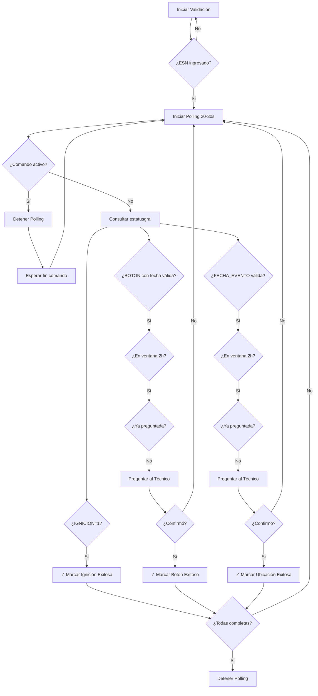

# Integración con TCV API - Pruebas Pasivas

Este documento describe la integración con el endpoint externo de TCV para la consulta de estatus de dispositivos en las pruebas pasivas.

## Arquitectura

La integración sigue el patrón de proxy seguro:

```
Frontend (React) → Supabase Edge Function → TCV API Externa
```

### ¿Por qué usar Edge Function?

- **Seguridad**: El token `TCV_CLIENT_ID` nunca se expone al frontend
- **CORS**: Manejo centralizado de headers y CORS
- **Control**: Timeout de 10 segundos y manejo de errores unificado

## Componentes de la Integración

### 1. Edge Function: `estatusgral`

**Ubicación**: `supabase/functions/estatusgral/index.ts`

**Función**: Proxy seguro que recibe el ESN del dispositivo y consulta el endpoint externo de TCV.

**Endpoint Externo**:
```
POST https://www.tcvsat.com.mx/tcvback/v3/api/pruebasinstalacion/estatusgral
```

**Request a Edge Function**:
```typescript
POST /functions/v1/estatusgral
Headers:
  - Content-Type: application/json
  - Authorization: Bearer {SUPABASE_ANON_KEY}

Body:
{
  "esn": "device_esn_here"
}
```

**Response del proveedor**:
```json
{
  "response": [
    {
      "BLOQUEO": 1,
      "FECHA_BLOQUEO": null,
      "BUZER": 0,
      "FECHA_BUZER": null,
      "IGNICION": 1,
      "BOTON": "20/10/2025 14:12:25",
      "ODOMETRO": 0,
      "LATITUD": "19.373575",
      "LONGITUD": "-99.1466866",
      "UBICACIONMAPS": "https://www.google.com.mx/maps/place/19.373575,-99.1466866",
      "FECHA_EVENTO": "20/10/2025 14:12:25"
    }
  ]
}
```

### 2. Hook: `useDevicePassiveStatus`

**Ubicación**: `src/hooks/useDevicePassiveStatus.ts`

**Responsabilidades**:
- Polling automático cada 20-30 segundos
- Detiene polling cuando hay comando activo
- Valida ventana de 2 horas para eventos de botón y ubicación
- Gestiona prioridades: Ignición → Botón de pánico → Ubicación
- Evita preguntas duplicadas mediante memoria de fechas

**Lógica de Prioridades**:

1. **Ignición**:
   - Si `IGNICION === 1` → Marca como exitosa automáticamente
   - No requiere confirmación del técnico

2. **Botón de Pánico**:
   - Solo si el campo `BOTON` tiene fecha válida (formato: dd/MM/yyyy HH:mm:ss)
   - Valida ventana de 2 horas: evento debe estar entre ahora y 2 horas atrás
   - Pregunta UNA VEZ al técnico con la fecha específica
   - Guarda fecha preguntada para no repetir

3. **Ubicación**:
   - Similar a botón, pero usa campo `FECHA_EVENTO`
   - Misma lógica de ventana de 2 horas
   - Pregunta UNA VEZ si fecha es válida y no preguntada antes

**Validación de Ventana de 2 Horas**:
```typescript
function esFechaValidaVentana2h(fechaStr: string): boolean {
  // Convierte dd/MM/yyyy HH:mm:ss a Date
  // Verifica: fecha <= ahora && fecha >= (ahora - 2 horas)
}
```

### 3. Componente: `PruebasPasivas`

**Ubicación**: `src/components/PruebasPasivas.tsx`

**Características**:
- Muestra estado en tiempo real de las pruebas pasivas
- Indicador de "Consultando..." durante polling
- Preguntas contextuales solo cuando hay eventos válidos
- Respeta bloqueo cuando hay comando activo
- Sistema de eventos para comunicación con el hook

## Configuración de Variables de Entorno

### Variables del Edge Function (Supabase)

Las siguientes variables se configuran **automáticamente** en Supabase y NO deben agregarse manualmente:

- `TCV_CLIENT_ID`: Token secreto proporcionado por TCV
- `TCV_API_BASE`: URL base de la API de TCV (`https://www.tcvsat.com.mx`)

**IMPORTANTE**: Estas variables NUNCA deben exponerse en el frontend ni en archivos `.env` locales.

### Variables del Frontend

Estas ya están configuradas en `.env`:

```bash
VITE_SUPABASE_ANON_KEY=your_anon_key
VITE_SUPABASE_URL=your_supabase_url
```

## Flujo de Validación de Pruebas Pasivas



## Reglas Críticas

1. **Nunca inventar valores**: Todas las confirmaciones se basan en datos reales del endpoint
2. **Ventana de 2 horas**: Solo eventos recientes (dentro de 2h) son válidos
3. **Una pregunta por evento**: Cada fecha se pregunta solo UNA VEZ
4. **Prioridad estricta**: Ignición → Botón → Ubicación
5. **Bloqueo por comando activo**: Polling se detiene completamente durante comandos activos
6. **Formato de fecha**: Validar siempre formato `dd/MM/yyyy HH:mm:ss`

## Ejemplo de Uso

```typescript
// En PruebasPasivas.tsx
const {
  consultando,
  error,
  preguntaPendiente,
  confirmarPreguntaPendiente,
} = useDevicePassiveStatus({
  esn: "device_esn",
  esperandoComandoActivo: false,
  ignicionExitosa: false,
  botonExitoso: false,
  ubicacionExitosa: false,
  botonFechaPreguntada: null,
  ubicacionFechaPreguntada: null,
  pruebasRequeridas: ['Ignición', 'Botón de pánico', 'Ubicación'],
});

// Cuando hay pregunta pendiente
if (preguntaPendiente) {
  // Mostrar UI de confirmación
  // Usuario responde Sí/No
  confirmarPreguntaPendiente(true); // o false
}
```

## Troubleshooting

### Error: "Configuración servidor incompleta"
**Causa**: Variables TCV_CLIENT_ID o TCV_API_BASE no están configuradas en Supabase Edge Function
**Solución**: Verificar que las variables estén correctamente configuradas en Supabase

### Error: "Timeout"
**Causa**: El endpoint externo tardó más de 10 segundos en responder
**Solución**: Verificar conectividad con TCV API

### Error: "Proveedor error"
**Causa**: El endpoint externo respondió con error (status !== 200)
**Solución**: Verificar que el ESN sea válido y que TCV_CLIENT_ID sea correcto

### No detecta eventos
**Causa**: Eventos fuera de ventana de 2 horas
**Solución**: Verificar que los eventos en TCV sean recientes (< 2 horas)

## Testing

Para probar la integración:

1. Ingresar un ESN válido de un dispositivo real
2. Verificar que inicia el polling (ver indicador "Consultando...")
3. Generar eventos reales en el dispositivo:
   - Encender ignición
   - Presionar botón de pánico
   - Verificar ubicación GPS
4. Confirmar que las preguntas aparecen automáticamente
5. Verificar que el polling se detiene al iniciar un comando activo

## Seguridad

- ✅ Token TCV_CLIENT_ID nunca expuesto al frontend
- ✅ Todas las llamadas pasan por Edge Function
- ✅ Timeout de 10 segundos para evitar bloqueos
- ✅ Validación de tipos en request
- ✅ CORS configurado correctamente
- ✅ No cache en requests
